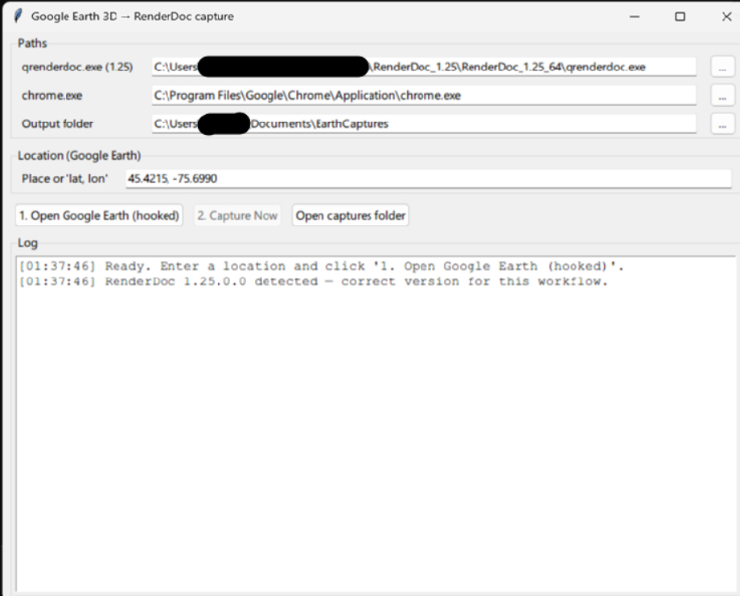

# Google Earth 3D → RenderDoc capture app

Automates the capture stage of the "import Google Earth into 3ds Max" workflow,
**up to producing the RenderDoc capture file (`.rdc`)** — with no manual
RenderDoc clicking. One button captures Google Earth's 3D photogrammetry for any
location.

## Why Google Earth (not Bing)

The Blender **Maps Models Importer** add-on was reverse-engineered specifically
for Google's 3D renderer. Bing Maps 3D uses a different engine the importer
can't read, so this targets Google Earth — the source the original video uses.

## Why the bundled RenderDoc 1.25

This workflow needs **RenderDoc 1.25** (bundled in `./tools/RenderDoc_1.25`).
Newer RenderDoc (e.g. 1.45) **crashes Chrome's GPU process the moment WebGL
renders**, and its captures aren't read by the Blender importer. 1.25 is stable
and is what the app uses by default.

## Prerequisites

- Windows, Google Chrome
- RenderDoc **1.25** — already bundled under `./tools`. (Full app also at
  https://renderdoc.org/builds if you want the standalone install.)
- Python 3.9+ (**No `pip install` required!** The app uses only standard Python libraries).

## Usage

1. Double-click `run.bat` (or run `python app.py`).
2. Paths auto-fill: the bundled qrenderdoc 1.25, your Chrome, and an output
   folder (default `Documents\EarthCaptures`).
3. Type a place name (e.g. `Ottawa Parliament`) or `lat, lon`.
4. Click **1. Open Google Earth (hooked)**. The app launches Chrome, injects
   RenderDoc 1.25 into the paused GPU process, and navigates to your location.
   A "Google Chrome Gpu" dialog appears briefly — the app clicks it for you; if
   it lingers, click OK once. (Do NOT click it before "Injecting..." is logged.)
5. In the Chrome window, **frame the buildings you want**.
6. Let the view stream in completely. Once it looks fully loaded, click
   **2. Capture Now**. The app will automatically orbit the camera in a small circle 
   for a 3-second countdown, and then capture the frame. This automatic motion forces 
   Google Earth to redraw every visible tile's geometry into the exact frame RenderDoc grabs.
7. The `.rdc` lands in your output folder; the log prints its path and size.

Chrome + qrenderdoc run in a throwaway profile and are cleaned up when the run
ends. For another capture, click **1** again.

## How it works (the parts that were tricky)

- **GPU-startup-dialog pause.** RenderDoc must wrap the D3D11 device *as it's
  created*. Injecting into an already-running GPU process is too late, so Chrome
  is launched with `--gpu-startup-dialog`, which pauses the GPU process at a
  message box; the worker injects, then dismisses the box so the device is
  created hooked.
- **No window = no F12.** Chrome's GPU process has no window, so RenderDoc's
  capture hotkey never reaches it. The capture is triggered programmatically over
  RenderDoc's **target-control** channel (`capture_worker.py`, run inside
  qrenderdoc's Python).
- **qrenderdoc's Python is stripped** (no `socket`/`ssl`). So the worker does
  only the RenderDoc parts; the outer app drives Chrome over the DevTools port
  and hands off through small flag files in `%TEMP%`.

## Files

- `app.py` — the GUI orchestrator (standard library only).
- `capture_worker.py` — runs inside qrenderdoc; injects + triggers the capture.
- `tools/RenderDoc_1.25/` — bundled RenderDoc 1.25 (portable).
- `run.bat` — launcher.

## After the .rdc (same as the video, out of scope here)

- Blender **4.1** + [Maps Models Importer v0.7.0](https://github.com/eliemichel/MapsModelsImporter):
  File > Import > Google Maps Capture → pick the `.rdc`.
- Export FBX → import into 3ds Max, re-link textures, rescale.

## Importing into Fusion 360

Fusion 360 handles textured meshes poorly through its standard local import. To get the Google Earth photo textures mapped onto your mesh in Fusion 360, use the cloud translator:

1. **Export from Blender:** Export your model as an **FBX**. In the export settings:
   - Set **Path Mode** to **Copy**.
   - **Crucial:** Click the small "Embed Textures" box icon right next to the Path Mode dropdown so it highlights blue.
   - Under Include, check **Selected Objects** and ensure only **Mesh** is highlighted.
   - Under Geometry, ensure **Apply Modifiers** and **Triangulate Faces** are checked.
2. **Upload to Fusion 360:** Do *not* use "Insert Mesh". Instead, open the **Data Panel** (grid icon, top left), click **Upload**, and select your FBX.
3. Autodesk's cloud servers will translate the file and preserve the textures. Once finished, double-click the file in the Data Panel to open it.
4. **Fixing Pastel Colors:** If your mesh opens and looks like random pastel colored blocks, Fusion has applied Mesh Face Group coloring. Press **`Shift + F`** to toggle Face Groups off (or uncheck it under Display Settings > Mesh Display), and ensure your Visual Style is set to Shaded. Your textures will then be visible.

## Missing tiles / "random chunks" in the imported model

Google Earth caches already-drawn tiles and, once the camera sits still,
composites them from that cache instead of re-submitting their geometry each
frame. A single captured still frame then contains only a subset of the tiles,
so chunks come out missing in Blender even though Chrome looks complete.

To fix it, the app **gently orbits the camera while the capture fires** (a small
circular mouse drag over the DevTools port). Motion invalidates the tile cache,
so Google Earth re-draws every visible tile's geometry into the captured frame.
Side effect: the framing wobbles by a few percent during capture — expected, and
worth it for a complete model. If tiles still look incomplete:

- Wait for all tiles to finish streaming *before* clicking Capture Now.
- Zoom in / lower the camera so fewer, higher-detail tiles cover the view (all at
  a consistent LOD, all on-screen).
- Remember you only capture what's on screen — frame the buildings you want.

## Other troubleshooting

- **The GPU-startup dialog** is auto-hidden and auto-dismissed; you should never
  need to click it. If injection fails, the app un-hides it so you can click OK
  manually as a fallback.
- **"GPU process died while loading"** → you're not on 1.25. Point the qrenderdoc
  path at `./tools/RenderDoc_1.25/RenderDoc_1.25_64/qrenderdoc.exe`.
- **Location won't resolve** → enter explicit `lat, lon` instead of a place name
  (place-name lookup uses OpenStreetMap Nominatim and needs internet).
